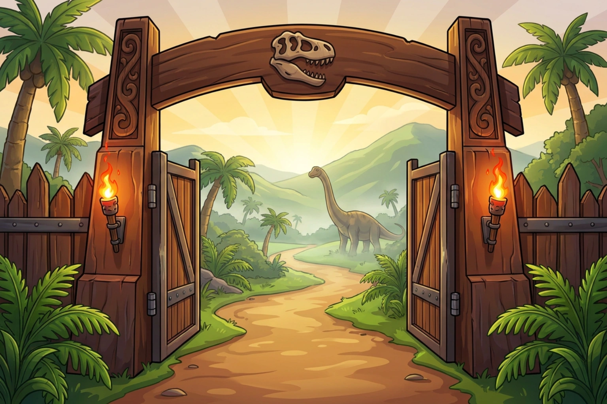

# Dino World 🦖

[](https://github.com/RegEdits-TSC/Dino-World-Discord-Bot/actions/workflows/ci.yml)
[](LICENSE)
[](package.json)
[](https://www.typescriptlang.org/)
[](https://discord.js.org/)



A dinosaur park tycoon game played entirely inside Discord. Build a park, hatch
eggs into a collection of 52 species, send dig crews out on expeditions, fight a
PvE campaign, and trade with other players — all through slash commands. Each
park belongs to one Discord user and travels with them across every server the
bot is in.

## ✨ Features

- 🏞️ **Build a park** — paddocks, facilities, and decor across lots you unlock as
  your rating grows, with `/park view` rendering your layout as a map image
- 🥚 **Hatch and collect** — 52 species across six rarities, from Common up to
  Mythic, each egg incubating on its own timer and hatching into illustrated art
- 🗺️ **Run expeditions** — send a dig crew out to themed sites and claim what they
  bring back
- ⚔️ **Fight a campaign** — six chapters of five stages, each ending in a boss,
  played out as a cinematic with star ratings and first-clear rewards
- 🍖 **Keep them fed** — six diet-typed foods, with herbivores and carnivores
  refusing each other's meals and hunger driving how much your park earns
- 🤝 **Trade** — offer dinos, eggs, cash, and food to other players and settle it in
  Discord
- 🧬 **Breed and splice** — pair matching dinos in the Gene Lab for eggs with
  better trait odds than the wild, or gamble on a `/splice` re-roll
- ⚔️ **Duel other players** — free exhibition fights, ghost or live, that move
  nothing but a zero-sum duel rating
- 🏆 **Climb leaderboards** — ranked by rating, cash, collection, legacy,
  battle stars, or duel rating, for your server or globally
- 📅 **Keep a daily streak** — roll a fresh quest board every day, claim
  milestone chests for consecutive claims, and work through twelve lifetime
  achievement tracks
- ⌨️ **Play without memorising ids** — every id option autocompletes, and `/help`
  walks you through your first ten minutes

## 🚀 Quick Start

Create an application in the [Discord Developer Portal](https://discord.com/developers/applications),
add a bot user, and invite it to your server with the `bot` and `applications.commands` scopes.
You need Node 22 or newer.

Copy the environment template and fill in your own values:

```bash
cp .env.example .env
```

| Variable | Required | What it is |
| --- | --- | --- |
| `DISCORD_TOKEN` | yes | Your bot's token, from the Discord Developer Portal |
| `DISCORD_CLIENT_ID` | yes | Your application's client id |
| `DATABASE_PATH` | yes | Where the SQLite database file is created |
| `OWNER_ID` | yes | The Discord user id allowed to run owner-only `/admin` commands |
| `DEV_GUILD_ID` | no | Deploy commands to one guild instantly instead of globally. Leave unset in production |
| `TEST_CHANNEL_ID` | no | Channel the live test sweep posts to |

Install dependencies:

```bash
npm i
```

Register the slash commands with Discord:

```bash
npm run deploy-commands
```

Re-run this whenever command definitions change — autocomplete flags and option
descriptions are part of the registered shape, so Discord will not pick them up
otherwise.

Build and upload the custom application emojis:

```bash
npm run build-emojis
npm run deploy-emojis
```

`build-emojis` renders the hand-authored SVGs in `assets/emojis/svg/` to PNGs in
`assets/emojis/png/`. `deploy-emojis` uploads any changed PNGs and rewrites
`assets/emojis/manifest.json`, **which must be committed afterward** — see the
[operations runbook](docs/ops.md) for why.

The bot's Discord profile art (avatar, banner) lives in `assets/branding/` and
is applied with `npm run deploy-branding`. This is a rare, live write — Discord
rate-limits profile edits to roughly two per hour — so it is not part of the
usual setup flow; run it only when the branding assets change, and pass
`--dry-run` first to validate both files (size and format) without sending the
request. Use `--avatar-only` or `--banner-only` to spend the rate-limit budget
on a single asset. `npm run make-gif` (`scripts/make-gif.ts`) is the encoder
that produces `assets/branding/*.gif` from source clips; see
`docs/assets/prompts.md` for the full pipeline. There is no automated check
for how the result looks in a client — verify it by eye in Discord after
deploying.

Start the bot, restarting on file changes:

```bash
npm run dev
```

Run exactly one bot instance per token. Two processes on the same token race each
other and every command fails.

## 📚 Documentation

| Guide | What is in it |
| --- | --- |
| [Command reference](docs/commands.md) | Every slash command, what it does, and who can run it |
| [Gameplay guide](docs/gameplay.md) | How the systems work — costs, timers, rewards, and gates |
| [Operations runbook](docs/ops.md) | Deploying to a VPS, running as a service, backups, release checks |
| [Contributing](CONTRIBUTING.md) | Setup, repository conventions, and how to send a change |

In Discord, `/help` is the in-game version: run it with no topic for a
first-ten-minutes walkthrough, or pass one of its twelve topics for a focused guide.

## 🧪 Development

Type checking is separate from the test suite. `npm test` runs vitest without
typechecking, and `npm run build` only compiles `src`, so a type error in a test
file passes both:

```bash
npm run typecheck
```

Compile to JavaScript:

```bash
npm run build
```

Run the offline suite:

```bash
npm test
```

This is a strict simulation of Discord's semantics — reply-once and defer rules,
payload size limits, and option getters checked against each command's real
builder. It covers commands, buttons, autocomplete, and the multi-step journeys
that string them together.

Run the live sweep against a dev guild:

```bash
npm run test:live
```

This deploys the current builders to `DEV_GUILD_ID` so Discord itself validates
them, drives every command, and posts the resulting embeds, buttons, and images
to `TEST_CHANNEL_ID` for cosmetic review. It is REST-only and never opens a
gateway connection, so it is safe to run while the bot is live.

CI runs the typecheck and the offline suite on every pull request and on pushes
to `main`.

## 📄 License

MIT — see [LICENSE](LICENSE).
