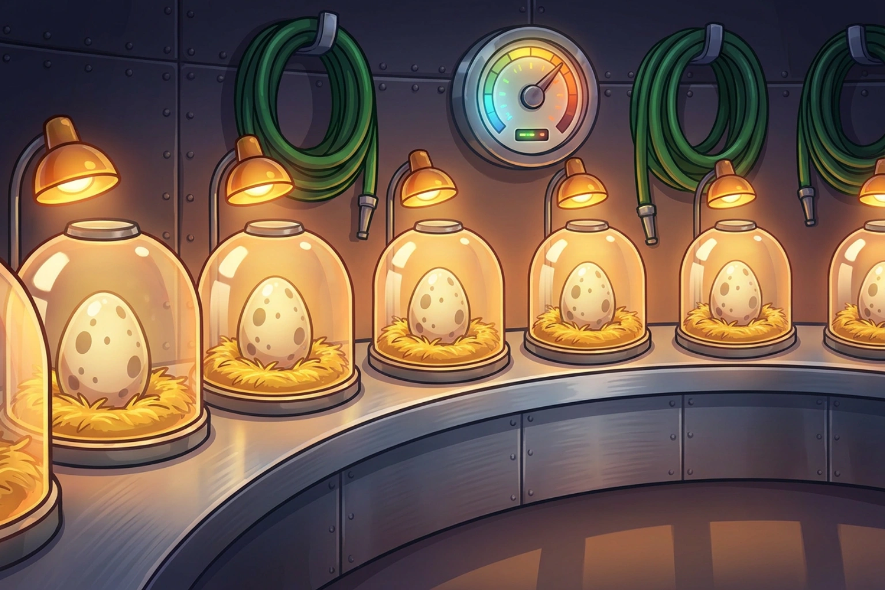

# Command Reference

Every slash command Dino World registers. Options marked **autocomplete** suggest
valid values as you type — start typing and pick from the list rather than
looking an id up by hand.

New here? The [gameplay guide](gameplay.md) explains the systems these commands
drive, and `/help` walks you through your first ten minutes in Discord.

## 🏞️ Park and building

| Command | What it does | Notes |
| --- | --- | --- |
| `/park view` | Your park dashboard, with a rendered map of your lots | Falls back to a text-only embed if the map cannot be rendered |
| `/park rename` | Rename your park | Up to 60 characters |
| `/build` | Build on an empty lot | |
| `/upgrade` | Upgrade a lot to the next level | Autocomplete: lot |
| `/decorate` | Add decor to a paddock | Autocomplete: lot |
| `/dino list` | List every dino you own | Paginated, 10 per page |
| `/dino assign` | Put a dino in a paddock so it starts earning | Autocomplete: dino, lot |
| `/dino unassign` | Take a dino out of its paddock | Autocomplete: dino |

## 🥚 Eggs and hatching

| Command | What it does | Notes |
| --- | --- | --- |
| `/eggs` | Your egg inventory and incubator status | Paginated, 10 per page |
| `/incubate` | Start incubating an egg | Autocomplete: egg |
| `/hatch` | Hatch an egg that has finished incubating | Autocomplete: egg. Reveals the species on a button press |
| `/mythic` | Trade shards for a Mythic egg | Needs 4.0★ best-ever rating. Asks for confirmation before spending |

## 🍖 Care

| Command | What it does | Notes |
| --- | --- | --- |
| `/feed one` | Feed a single dino | Autocomplete: dino, food. Food must match the dino's diet |
| `/feed all` | Feed every hungry dino, hungriest first | |
| `/rescue` | Recapture a dino that escaped | Autocomplete: dino |

## 🗺️ Expeditions

| Command | What it does | Notes |
| --- | --- | --- |
| `/expedition start` | Send a dig crew out to a site | Autocomplete: site |
| `/expedition status` | Check how long your active expedition has left | |
| `/expedition claim` | Collect the rewards from a returned expedition | |

## ⚔️ Battles

| Command | What it does | Notes |
| --- | --- | --- |
| `/battle chapters` | Browse the campaign, your stars, and your energy | Prev/Next buttons |
| `/battle fight` | Send a squad of one to three dinos into a stage | Autocomplete: stage, dino1, dino2, dino3. Costs energy |

## 🛒 Shop and selling

| Command | What it does | Notes |
| --- | --- | --- |
| `/shop view` | Today's shop rotation | Changes once a day |
| `/shop egg` | Buy an egg | Autocomplete: rarity. Only rarities in today's rotation |
| `/shop food` | Buy food by item and quantity | Autocomplete: item |
| `/sell` | Sell a dino for cash and shards | Autocomplete: dino |

## 🤝 Trading

| Command | What it does | Notes |
| --- | --- | --- |
| `/trade offer` | Offer a trade to another player | Autocomplete on all six give/want fields |
| `/trade list` | Your pending trades, incoming and outgoing | Paginated, 10 per page |
| `/trade accept` | Accept a trade offered to you | Autocomplete: id |
| `/trade decline` | Decline a trade offered to you | Autocomplete: id |
| `/trade cancel` | Withdraw a trade you sent | Autocomplete: id |

## 🏆 Progress

| Command | What it does | Notes |
| --- | --- | --- |
| `/top` | Leaderboards by rating, cash, or collection | Server or global scope |
| `/help` | How to play, across nine topics | Run with no topic for a first-ten-minutes walkthrough |

## ⚙️ Server settings and admin

| Command | What it does | Notes |
| --- | --- | --- |
| `/settings channel` | Set where the bot posts hatch and expedition notifications | **Requires the Manage Server permission** |
| `/admin give` | Grant resources to a player | Autocomplete: dino-species. **Bot owner only** |
| `/admin inspect` | Dump a player's raw state | **Bot owner only** |
| `/admin reset` | Reset a player to a fresh start | **Bot owner only** |
| `/admin fast-forward` | Advance a player's clock, for testing | **Bot owner only** |
