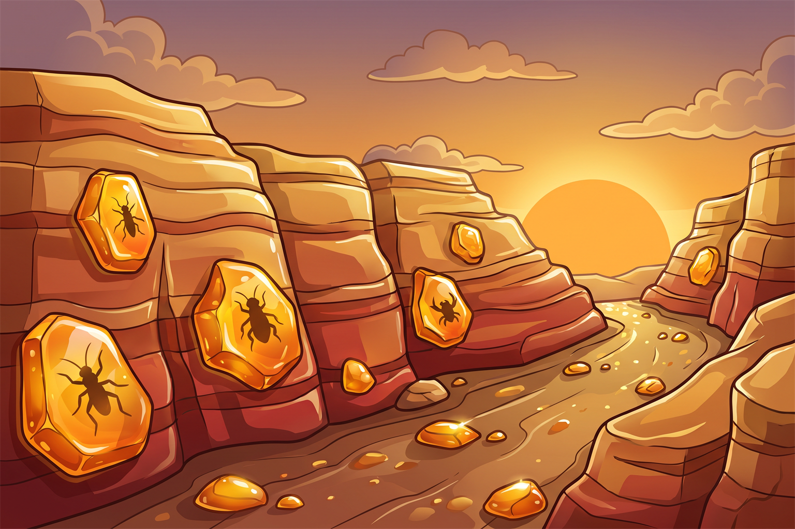

# Gameplay Guide

How Dino World actually works — what everything costs, how long things take, and
what raises your rating. For the commands themselves, see the
[command reference](commands.md).

## 1. Getting started

There is no `/start` or `/register`. Your park is created automatically the
first time you run any command — there is nothing to set up first. It is also
created for you the moment someone offers you a trade, even if you have never
touched the bot yourself.

Every new park begins with the same starting package:

| Thing | Starting value |
| --- | --- |
| Cash | 500 |
| Battle energy | 10 (already at the cap) |
| Park name | "New Park" |
| Park rating | 0.0★ |
| Pantry | 10 Ferns, 10 Fish |
| Lot slots | 3 |
| Incubator slots | 1 |

You begin with no dinos, no eggs, and no built lots — the pantry above is the
only inventory you start with.

## 2. Currencies

Dino World runs on four resources. Cash, Food, and Rating appear on the
`/park view` dashboard — Food shown per-item with counts, not as a single
number. Battle energy is visible on `/battle chapters` and on the
fight-result screen, not on the dashboard. Shards are the odd one out — see
the note below.

| Currency | What it is | How you earn it | What it's for |
| --- | --- | --- | --- |
| Cash | Main currency, never goes negative | Idle income from your dinos, expedition claims, selling dinos, winning battles | Building and upgrading lots, decor, food, expedition fees, shop eggs, rescue fees |
| Shards | Premium currency | Selling dinos, and the first time you clear a battle stage | Exactly one thing: buying a Mythic egg (500 shards) |
| Food | Six named items, not a single number | Bought with cash, dropped by expeditions and battles, tradeable | Feeding your dinos to keep their hunger up |
| Battle energy | Regenerates on its own, not really a currency | Regenerates over time (capped at 10) | Entering battle stages; cannot be bought, gifted, or refilled by any item |

**There is no player-facing screen that shows your shard balance.** The park
dashboard has five fields — Cash, Food, Rating, Dinos, Lots — and none of them
is shards. The only place a shard total is ever displayed is in the
confirmation message you get right after selling a dino. Do not go looking for
a shard count on `/park view`; it isn't there.

## 3. Your park

### Lot slots

You start with 3 lot slots and unlock one more each time your best-ever rating
crosses a threshold, up to a maximum of 8. Slots are gated by your **best-ever**
rating, which never falls — so once a slot unlocks, it's yours for good, even
if your current rating later drops. There is no way to buy a slot with cash.

| Slots unlocked | Rating needed |
| --- | --- |
| 1–3 | from the start |
| 4 | 0.5★ |
| 5 | 1.0★ |
| 6 | 2.0★ |
| 7 | 3.0★ |
| 8 | 4.0★ |

### Lot types

Every lot starts at level 1 with no decor. There are two kinds of paddock and
three kinds of facility:

| Lot | Type | Build cost | Max level |
| --- | --- | --- | --- |
| Herbivore Paddock | paddock | 2,000 | 4 |
| Carnivore Paddock | paddock | 2,000 | 4 |
| Visitor Center | facility | 5,000 | 5 |
| Food Court | facility | 8,000 | 3 |
| Hatchery Lab | facility | 10,000 | 3 |

Dinos can only be assigned to paddocks — never to facilities. Each paddock
holds 2 dinos per level, and upgrading roughly multiplies the previous cost by
2.5:

| Paddock level | Capacity | Cost to reach this level |
| --- | --- | --- |
| 1 | 2 | 2,000 (build) |
| 2 | 4 | 5,000 |
| 3 | 6 | 12,500 |
| 4 | 8 | 31,250 |

The **Visitor Center** sets the time window your idle income accumulates over
before it caps, and adds a flat bonus to your income:

| Level | Income cap window | Income bonus | Cost to reach |
| --- | --- | --- | --- |
| 1 | 8 h | +0% | 5,000 (build) |
| 2 | 12 h | +5% | 12,500 |
| 3 | 16 h | +10% | 31,000 |
| 4 | 20 h | +15% | 78,000 |
| 5 | 24 h | +20% | 500,000 |

The **Food Court** adds only an income bonus:

| Level | Income bonus | Cost to reach |
| --- | --- | --- |
| 1 | +4% | 8,000 (build) |
| 2 | +8% | 20,000 |
| 3 | +12% | 200,000 |

The **Hatchery Lab** grants incubator slots and nothing else — no income
bonus. A level-1 Lab gives you the same single slot you already have without
one, so the real upgrades start at level 2:

| Hatchery Lab level | Incubator slots | Cost to reach |
| --- | --- | --- |
| none | 1 | — |
| 1 | 1 | 10,000 (build) |
| 2 | 2 | 25,000 |
| 3 | 3 | 150,000 |

If you build more than one of the same facility, their income bonuses stack —
there's nothing stopping you from doing that.

### Decor

Decor is bought per paddock with `/decorate`. There are eight items, each
tagged to a biome:

| Decoration | Cash | Biome tag |
| --- | --- | --- |
| Grass Tuft | 400 | plains |
| Palm Tree | 500 | forest |
| Fern Cluster | 500 | forest, swamp |
| Boulder | 500 | plains |
| Reed Bed | 600 | swamp |
| Tide Pool | 700 | coast |
| Ice Block | 700 | tundra |
| Lava Rock | 800 | volcanic |

Decor can only be placed on paddocks, not facilities. You can stack as many
pieces on a paddock as you like — there's no per-paddock limit and no way to
remove one once placed. Every piece of decor you own raises your park rating,
because the rating's build-out term counts decor pieces alongside lot levels.

### The park map

`/park view` doesn't just show numbers — it renders an image of your park as
a grid of tiles, one per lot, showing each lot's icon, name, level, and the
dinos assigned to it. If the image ever fails to render, the dashboard still
replies with the same information as plain text, so the map is never required
to play.

## 4. Income

An assigned dino earns cash automatically over time, at a rate set by its
rarity and scaled by its comfort:

| Rarity | Income per hour |
| --- | --- |
| Common | 60 |
| Uncommon | 150 |
| Rare | 400 |
| Epic | 1,100 |
| Legendary | 3,000 |
| Mythic | 9,000 |

Only dinos assigned to a paddock earn anything — an unassigned dino sits at
zero comfort and produces nothing. A dino stops earning the instant its
hunger reaches 0, or the instant it escapes, whichever happens first.

Comfort itself is driven by hunger: as a dino's hunger drains, its comfort —
and therefore its earning rate — declines with it, down to nothing once
hunger and comfort bottom out. Overfeeding a dino past full hunger doesn't
raise its earning rate any further; it's paid fairly for the time it actually
spends at full comfort, then for the time it spends declining, roughly like a
dino that was fed a normal amount — overfeeding buys time before hunger runs
out, not a higher payout.

Income only accumulates within a capped window measured from your last
collection — 8 hours by default, or longer with a higher-level Visitor
Center. Time beyond that cap earns nothing, so collecting regularly matters;
pressing Collect resets the window and starts the clock over. The dashboard
warns you when pending income has been sitting long enough to be capped. Once
totalled, your facility income bonuses are added on top and the result is
rounded down to a whole number of cash.

## 5. Eggs and hatching

The six rarities, from lowest to highest: Common, Uncommon, Rare, Epic,
Legendary, Mythic.

Each rarity has its own fixed incubation time:

| Rarity | Incubation time |
| --- | --- |
| Common | 15 min |
| Uncommon | 1 h |
| Rare | 4 h |
| Epic | 12 h |
| Legendary | 24 h |
| Mythic | 48 h |

You can only incubate as many eggs at once as you have incubator slots — 1 by
default, or up to 3 with a fully upgraded Hatchery Lab. There's no limit on
how many eggs you can simply hold in reserve; only simultaneous incubation is
capped. A finished egg does not free its slot on its own — it keeps occupying
that incubator slot until you actually hatch it, so a full bank of ready eggs
can block you from starting any new ones.

The species inside an egg isn't decided when you get the egg — it's rolled
the moment you hatch it (unless the egg's species was pinned when you got it,
as with a Mythic egg bought with shards). Within its rarity, every species has
an equal chance: a flat pick across that rarity's pool, with no weighting
toward rarer or more desirable species and no duplicate protection — you can
hatch the same species twice in a row.

A newly hatched dino arrives unassigned to any paddock, and it earns nothing
until you place it in one.

## 6. The roster

Dino World has 30 species split across six rarities: 8 Common, 7 Uncommon, 6
Rare, 4 Epic, 3 Legendary, and 2 Mythic. Diet determines which paddock a dino
can live in without its comfort being halved, so it's worth knowing before you
start hatching: 16 species are herbivores and 14 are carnivores.

| Species | Rarity | Diet |
| --- | --- | --- |
| Triceratops | Common | herbivore |
| Gallimimus | Common | herbivore |
| Dryosaurus | Common | herbivore |
| Compsognathus | Common | carnivore |
| Struthiomimus | Common | herbivore |
| Othnielia | Common | herbivore |
| Microceratus | Common | herbivore |
| Nasutoceratops | Common | herbivore |
| Stegosaurus | Uncommon | herbivore |
| Parasaurolophus | Uncommon | herbivore |
| Dilophosaurus | Uncommon | carnivore |
| Iguanodon | Uncommon | herbivore |
| Maiasaura | Uncommon | herbivore |
| Pachycephalosaurus | Uncommon | herbivore |
| Ouranosaurus | Uncommon | herbivore |
| Velociraptor | Rare | carnivore |
| Carnotaurus | Rare | carnivore |
| Baryonyx | Rare | carnivore |
| Allosaurus | Rare | carnivore |
| Ankylosaurus | Rare | herbivore |
| Ceratosaurus | Rare | carnivore |
| Brachiosaurus | Epic | herbivore |
| Spinosaurus | Epic | carnivore |
| Therizinosaurus | Epic | herbivore |
| Giganotosaurus | Epic | carnivore |
| Tyrannosaurus | Legendary | carnivore |
| Mosasaurus | Legendary | carnivore |
| Quetzalcoatlus | Legendary | carnivore |
| Indominus rex | Mythic | carnivore |
| Indoraptor | Mythic | carnivore |

## 7. Care

### Hunger

Hunger drains on its own, linearly, from whatever it was last fed to down to 0
over 48 hours — about 2.08 points per hour — and it never goes negative.
Feeding **sets** hunger to a food's fill value rather than adding to it: a
dino sitting at 90 that eats Ferns (fills to 100) ends at exactly 100 — the
90 is simply overwritten, not added to. Because the drain rate is fixed, a
dino fed to a higher value takes longer to reach zero — a dino fed to 150
takes about 72 hours. Only three things ever change hunger: feeding, being
rescued, and that passive drain. A freshly hatched dino starts at hunger
100.

### Comfort and habitat fit

Comfort is what actually matters for income and rating. It's hunger (counted
only up to 100, so overfeeding doesn't help comfort) expressed as a
percentage, multiplied by how well the paddock suits that dino:

- A dino in the **correct-diet** paddock for its species keeps 75% of its
  hunger-based comfort.
- A dino in the **wrong-diet** paddock keeps only 50%.
- A dino with **no paddock at all** has 0% comfort, full stop — it earns
  nothing and cannot escape, since escaping requires being somewhere to
  escape from.

Assigning a dino to the wrong-diet paddock isn't blocked — the game warns you
first and asks you to confirm — but it halves that dino's comfort for as
long as it stays there. Comfort feeds both your income (see Income above)
and the comfort third of your park rating (see Rating and leaderboards
below).

### Escapes

A dino escapes once its comfort has stayed below 25% for 8 straight hours in
a row — a grace period, not an instant trip wire. Escapes aren't caught in
real time; they're settled the next time any command touches your park,
including someone else simply looking at it with `/park view`. Whenever it's
settled, the game records the *actual* moment the dino left, not the moment
anyone noticed.

Feeding a higher tier buys more time before that clock can even start,
because it takes longer for hunger to fall far enough to drop comfort under
25%. Roughly, from a fresh feed:

| Paddock | Fed to 100 | Fed to 125 | Fed to 150 |
| --- | --- | --- | --- |
| Correct-diet paddock | about 40 h | about 52 h | about 64 h |
| Wrong-diet paddock | 32 h | about 44 h | about 56 h |

The dashboard flags a dino as "at risk" once its projected escape is within
12 hours, and `/dino list` shows the same countdown per dino — but only for
an assigned dino with a projected escape time; an unassigned dino never
shows this warning (it also never escapes). Separately, the food pickers tag
a dino "VERY HUNGRY" once 36 hours have passed since it was last fed — that
tag is based purely on time since feeding, not on actual hunger, so a dino
fed Royal Greens can be flagged VERY HUNGRY while its real hunger — and its
real escape risk — is still comfortably high. Treat the two warnings as
separate signals, not the same thing.

An escaped dino cannot be fed, assigned to a paddock, entered into a battle,
or offered in a trade, and it earns no income and drops out of the comfort
average behind your rating. It can, however, still be sold.

### Rescue

`/rescue` recaptures an escaped dino for a cash fee equal to four hours of
that dino's normal income rate:

| Rarity | Rescue fee |
| --- | --- |
| Common | 240 |
| Uncommon | 600 |
| Rare | 1,600 |
| Epic | 4,400 |
| Legendary | 12,000 |
| Mythic | 36,000 |

Rescue doesn't fully restore the dino — it resets hunger to about half of
what full comfort would take: 67 in a correct-diet paddock, or 100 in a
wrong-diet paddock (which is halved anyway, so it ends up at a similar
comfort either way). The escaped flag clears immediately and the dino starts
earning again right away. You can't rescue a dino that hasn't escaped, and
if you can't afford the fee, nothing changes.

## 8. Food

Food is six named items — three price tiers for each diet — bought with cash
from `/shop food` and kept in your pantry, not a single number:

| Item | Diet | Tier | Cash per unit | Fills hunger to |
| --- | --- | --- | --- | --- |
| Ferns | herbivore | 1 | 10 | 100 |
| Fruit Basket | herbivore | 2 | 15 | 125 |
| Royal Greens | herbivore | 3 | 20 | 150 |
| Fish | carnivore | 1 | 12 | 100 |
| Goat | carnivore | 2 | 18 | 125 |
| Prime Steak | carnivore | 3 | 24 | 150 |

Feeding **sets** a dino's hunger to that item's fill value — it's a reset,
not a top-up. The two higher tiers overfill past 100, which doesn't raise a
dino's comfort or income any further, but it does buy more real time before
hunger runs out and the dino risks escaping (see Care above). A dino only
accepts food matching its own diet — offering the wrong diet is refused
outright, not merely penalized.

The shop suggests buying in bundles of 10, 50, or 100 units, but any
positive amount is allowed and there's no maximum — only your cash balance
limits a purchase.

Feeding itself costs **food units from your pantry, not cash**. How many
units a single feed consumes depends on the dino's rarity:

| Rarity | Feed cost (food units) |
| --- | --- |
| Common | 5 |
| Uncommon | 10 |
| Rare | 20 |
| Epic | 40 |
| Legendary | 80 |
| Mythic | 160 |

Leave the food option blank on `/feed one` and the game automatically picks
the cheapest food of the right diet that you own enough of. `/feed all`
feeds every dino whose current (already-decayed) hunger is under 100,
skips escaped dinos, and works through the hungriest dinos first — if it
runs out of matching food partway through, it reports which dinos it had to
skip and keeps going for the rest.

## 9. Expeditions

Expeditions don't use any dinos — you send a dig crew to one of four sites,
pay a cash fee up front, wait out the duration, and claim the results. Only
one expedition can be out at a time.

| Site | Unlocks at | Cost | Duration | Cash bonus | Food bonus |
| --- | --- | --- | --- | --- | --- |
| Coastal Dig | 0.0★ | 200 | 15 min | 50–200 | 2–6 |
| Amber Ridge | 1.5★ | 1,000 | 1 h | 200–800 | 4–10 |
| Frozen Cliffs | 2.5★ | 4,000 | 4 h | 800–2,500 | 8–20 |
| Volcano Core | 4.0★ | 15,000 | 8 h | 3,000–9,000 | 20–50 |

Site unlocks are gated on your **best-ever** rating, so a site never
re-locks even if your current rating later drops. No site's maximum cash
bonus can beat its fee outright — at Coastal Dig the best case (200) merely
breaks even — so an expedition is never a guaranteed cash profit on its own;
the egg and the food are the real payoff.

Every claim pays out exactly three things at once: one egg, a cash amount
rolled anywhere between the site's min and max (inclusive), and a stack of
food. The food is always the tier-1 item of a diet chosen by a 50/50 coin
flip at claim time — Ferns or Fish — regardless of what your park actually
raises, so an all-herbivore park will still get handed Fish about half the
time. Expeditions never pay shards. The egg itself arrives with no species
assigned yet — you still need to incubate and hatch it like any other egg.

The egg's rarity is rolled from odds set per site:

| Site | Common | Uncommon | Rare | Epic | Legendary | Mythic |
| --- | --- | --- | --- | --- | --- | --- |
| Coastal Dig | 70% | 30% | — | — | — | — |
| Amber Ridge | 45% | 40% | 15% | — | — | — |
| Frozen Cliffs | — | 40% | 40% | 20% | — | — |
| Volcano Core | — | — | 40% | 40% | 19.8% | 0.2% |

Volcano Core is the only site that can ever drop a Legendary or Mythic egg.
There is no failure, risk, or partial-loss outcome — a returned expedition
always pays its full loot — and there is no cancel or refund once you've
sent a crew out.

## 10. The battle campaign

### Chapters and unlocking

The campaign is four chapters, each five stages long, with the fifth stage
always the boss:

| # | Chapter |
| --- | --- |
| 1 | Coastal Dig |
| 2 | Amber Ridge |
| 3 | Frozen Cliffs |
| 4 | Volcano Core |

Within a chapter, stage 1 is always open, and every later stage unlocks once
you've earned at least 1 star on the stage before it. Chapter 1 is always
open too. Every later chapter needs **both** a recorded first clear of the
previous chapter's boss **and** a best-ever park rating at or above that
chapter's gate — the same thresholds as the identically named expedition
sites: 0.0★, 1.5★, 2.5★, and 4.0★.

### Energy

Fighting costs battle energy, the resource shown on `/battle chapters` and
on the fight-result screen — never on the park dashboard. The pool caps at
10 and regenerates one point every 10 minutes, so a full refill from empty
takes about 100 minutes. Energy is spent whether you win or lose, and it
can't be bought, gifted, or refilled by any item. Trying to fight without
enough energy is refused up front, before anything happens, and tells you
exactly how much you have and when the next point lands.

Within a chapter, the first three stages cost 1 energy each, the fourth
costs 2, and every boss stage costs 3.

### Squads

You bring 1 to 3 of your own dinos into a stage; the same dino can't be
entered twice. An escaped dino can't fight and is filtered out of the
picker entirely. A dino currently locked in a pending trade **can** still
fight — battling never transfers or consumes a dino.

The number of enemies you face matches your squad size, and normal stages
field their weakest enemies first — a solo dino only ever meets the single
weakest enemy on a normal stage. Boss stages are the exception: the boss is
always in the fight no matter your squad size, so on a boss stage a smaller
squad doesn't mean an easier fight — with one or two dinos you still face
the boss, just with fewer or no other enemies alongside it.

### How stars are decided

The game checks these conditions **in order**, and stops at the first one
that matches:

1. Lose the fight → **0 stars**.
2. Win without losing a single dino → **3 stars**.
3. Otherwise, win by losing at most one dino, or by finishing within 12
   rounds → **2 stars**.
4. Any other win → **1 star**.

The round-count fallback matters: a win finished within 12 rounds still
earns 2 stars even if you lost two or more dinos along the way, while a
slower win (past round 12) with those same losses only earns 1 star. Your
recorded best for a stage only ever improves; a weaker rerun never lowers
it, and every attempt still counts toward your history.

### Rewards

Cash, food, and battle XP for a stage all scale with the stars you earn:

| Reward | Loss | 1★ | 2★ | 3★ |
| --- | --- | --- | --- | --- |
| Cash | 0 | ×1 | ×1.25 | ×1.5 |
| Food | 0 | ×1 | ×1.25 | ×1.5 |
| Battle XP | ×0.25 (consolation) | ×1 | ×1.25 | ×1.5 |

The first time you clear a stage, you also earn a one-time first-clear shard
bonus that is **not** scaled by stars — a scrappy 1-star first win pays the
same shards as a flawless 3-star one. Clearing every stage in all four
chapters for the first time pays 93 first-clear shards in total across the
whole campaign.

Battle XP for a win is split evenly across your squad (rounded down, with
any leftover point going to your first squad slot), so a solo dino keeps
the entire payout. Each dino has its own battle level, separate from its
rarity, capped at level 10:

| Level | Cumulative XP needed |
| --- | --- |
| 2 | 100 |
| 3 | 250 |
| 4 | 450 |
| 5 | 700 |
| 6 | 1,000 |
| 7 | 1,400 |
| 8 | 1,900 |
| 9 | 2,500 |
| 10 | 3,200 |

**Every reward from a fight is banked before the cinematic even plays**, so
skipping the animation with the Skip button never costs you any part of the
payout.

### Bosses

Each chapter's fifth stage pits you against that chapter's boss — a tougher
version of the chapter's strongest enemy species, with roughly two and a
half times the HP and about a fifth more attack than a normal encounter of
that species. Clearing a boss for the first time awards a one-time trophy
egg (repeat clears pay no further egg):

| Boss | Chapter | Trophy egg rarity | Species |
| --- | --- | --- | --- |
| Old Riptooth | Coastal Dig | Rare | rolls at hatch |
| Ridgeback Alpha | Amber Ridge | Epic | rolls at hatch |
| Stormwing | Frozen Cliffs | Legendary | rolls at hatch |
| The Tyrant King | Volcano Core | Legendary | pinned: Tyrannosaurus |

No boss ever drops a Mythic egg. Beating a chapter's boss for the first
time is also, alongside the matching rating threshold, one half of what
unlocks the next chapter.

## 11. Shop and selling

### Buying eggs

`/shop egg` sells eggs at a flat price per rarity, drawn from a rotation that
changes once a day:

| Rarity | Shop price |
| --- | --- |
| Common | 500 |
| Uncommon | 2,000 |
| Rare | 8,000 |
| Epic | 30,000 |
| Legendary | 120,000 |
| Mythic | never sold here — buy with shards via `/mythic` instead |

Each day the shop draws up to 3 rarities from the pool at or below your
rarity ceiling, and — only once your ceiling reaches Legendary — has a
separate 10% chance to add a Legendary egg on top, making that a
four-egg day. While your ceiling is still Uncommon, there are only 2
rarities to draw from, so the shop shows 2. Trying to buy a rarity that
isn't in today's rotation is refused.

Your rarity ceiling is set by your **best-ever** park rating:

| Best-ever rating | Highest buyable rarity |
| --- | --- |
| below 1.0★ | Uncommon |
| 1.0★ | Rare |
| 2.0★ | Epic |
| 3.5★ | Legendary |

### Selling dinos

`/sell` shows a confirm preview with the cash value and shard range before
anything happens — nothing is sold until you press Confirm, and the dino is
then permanently removed from your park. Cash is a flat amount by rarity;
shards are a random roll within a range:

| Rarity | Sell cash | Sell shards |
| --- | --- | --- |
| Common | 50 | 1–3 |
| Uncommon | 150 | 3–6 |
| Rare | 500 | 8–15 |
| Epic | 1,500 | 20–35 |
| Legendary | 5,000 | 50–80 |
| Mythic | — | — |

**Mythics cannot be sold at all.** A dino locked in a pending trade can't be
sold either. A dino you received through a trade still sells for its full
cash value, but always pays 0 shards. Selling always recomputes your park
rating.

Selling also has a shard cap: you can earn at most 40 shards from selling
dinos within any rolling 24-hour window. Sales past that cap still pay their
full cash value — you simply stop earning extra shards from selling until
your next sale more than 24 hours after the window opened.

## 12. Trading

`/trade` has five subcommands: `offer`, `list`, `accept`, `decline`, and
`cancel`. An offer names one other player and sets both sides of the deal at
once — what you're giving and what you want back — in up to four
categories per side: dinos, eggs, cash, and one stack of a single food item.
Shards can never be part of a trade.

### Gates and limits

| Rule | Value |
| --- | --- |
| Minimum park rating, both players | 2.0★ — checked against your **current** rating, the one gate in the game that isn't based on your best-ever high mark |
| Trades you may start | 3 within any rolling 24 hours, counting every trade you've sent in that window, even ones that were declined, cancelled, or expired |
| Items per side | up to 5, counting dinos, eggs, and food stacks together — cash doesn't count, and a whole food stack counts as just one item no matter its quantity |
| Offer expiry | 24 hours after it's sent |

The rating gate is re-checked again at the moment of acceptance, not just
when the offer is sent.

### What can't be traded

Mythic dinos and Mythic eggs can never be traded, an escaped dino can't be
offered until it's rescued, an egg that's currently incubating can't be
traded, and you can't trade with yourself or with a bot. Anything already
locked in another pending trade of yours can't be offered again until that
trade resolves.

### Flow

The moment you send an offer, everything you're giving is locked — it can't
be sold or offered in a second trade while the offer is pending. Only the
recipient can accept or decline an offer, and only the sender can cancel
one. Accepting re-checks that both sides still actually own and can afford
everything in the deal; if something has changed, the accept simply fails
and the offer stays open, so the sender can still cancel it. Declining,
cancelling, or letting an offer expire closes it and unlocks everything —
nothing changes hands. Cash and food always net out exactly between the two
players, so a trade never creates currency out of nothing.

When a trade goes through, both players' park ratings are recalculated
immediately, and any dinos received arrive unassigned — you'll need to place
them in a paddock before they start earning. Anything you receive through a
trade — dino or egg — always sells for 0 shards later, though it still sells
for its full cash value.

`/trade list` shows your pending trades, incoming and outgoing, 10 per page.

## 13. Rating and leaderboards

### How it's calculated

Park rating is built from three weighted components, each capped at 1 (100%):

| Component | Weight | What raises it |
| --- | --- | --- |
| Collection | 40% | The summed rarity value of the **distinct** species you own, out of the value of all 30 species combined. Owning duplicates of a species you already have adds nothing further. |
| Park | 35% | The combined levels of all your lots plus the total number of decor pieces you've placed, out of a maximum of 40. |
| Comfort | 25% | The average comfort of dinos that are currently assigned to a paddock and haven't escaped. Unassigned or escaped dinos are simply left out of the average — they don't drag it down, but they also don't help. |

The three components combine into a score out of 500, which is what's
displayed as stars to one decimal place — a rating of 340 shows as 3.4★.
Since none of the three components can score above 1, a park's rating
tops out at 5.0★.

### When it actually updates

Your rating is recalculated whenever you hatch, sell, assign or unassign a
dino, decorate, build, upgrade a lot, feed, rescue, or complete a trade.

**It is not recalculated by viewing your park, by collecting income, or
simply by time passing** — even though the comfort component would
technically change continuously as hunger drains. The number shown on your
dashboard, on `/top`, and checked at the trade gate stays exactly where it
was after your last rating-changing action until you do one of the things
above again. Battle results don't feed rating directly either — winning
fights and earning stars never touches it. The one indirect link is a boss's
trophy egg: hatching it can add a new species to your collection and raise
that component.

### Best-ever vs. current rating

Alongside your current rating, the game separately tracks the highest rating
you've ever reached, and that number never falls even if your current rating
later drops. Almost every gate in the game — lot slots, expedition site
unlocks, the shop's rarity ceiling, Mythic purchases (which need 4.0★), and
the battle campaign's chapter gates — checks your **best-ever** rating.
Trading is the lone exception: its 2.0★ minimum checks your **current**
rating, so it's the one gate you can actually lose access to if your rating
falls.

### `/top`

`/top` ranks players by one of three metrics — rating, cash, or collection —
scoped to either your server or globally. Left unset, it defaults to your
server when run inside a server and to global when run in a DM. It always
shows the top 10 with no further pages; if you're not in that top 10, a
footer line shows your own rank and value instead. Server scope only ranks
players who have used the bot in that server; global scope ranks every
registered player anywhere. There's no tiebreak rule for players with equal
values — their relative order isn't defined.

## 14. Notifications

The bot can proactively notify you about three things: an egg finishing
incubation, an expedition returning, and trade activity. There are no
hunger or escape notifications of any kind — those are only ever surfaced
when you next run a command yourself.

- **Egg ready** — fires once the egg you're incubating finishes, naming its
  rarity and pointing you at `/hatch`.
- **Expedition returned** — fires once your expedition's timer is up,
  naming the site and pointing you at `/expedition claim`.
- **Trade activity** — fires immediately rather than on a timer: the
  recipient is notified the moment an offer is sent to them, and the
  sender is notified when it's accepted or declined. Cancelling a trade you
  sent notifies no one.

Either of the timer-based notifications is simply skipped if you've already
handled it yourself (already hatched the egg, or already claimed the
expedition) by the time it would have fired.

### Where it goes

Notifications go to a server's configured notification channel first, with
a ping, if one is set; otherwise they arrive as a DM with no ping. If the
channel can't be posted to for any reason, the bot silently falls back to a
DM, and if that also fails, the notification is simply dropped. The channel
used is always the one configured in the server where you started the
timer — not wherever you happen to be when it eventually fires — and if you
started the incubation or expedition inside a DM, the notification arrives
by DM regardless. Trade notifications follow the same channel-then-DM rule.

Notifications are checked roughly every 30 seconds, so one can land up to
about half a minute after it technically came due. If the bot was offline
when something became due, it still notifies you once it's back — late,
never dropped.

### `/settings channel`

Server admins with the Manage Server permission can run `/settings channel`
to set where hatch and expedition notifications post in that server —
it only accepts a normal text channel, and only works when run inside a
server. Running it again simply replaces the previous channel; there's no
way to clear or unset it once set. There's no per-player notification
preference anywhere in the game — no DM opt-out, no per-type toggle — the
only thing stored is one channel per server.
